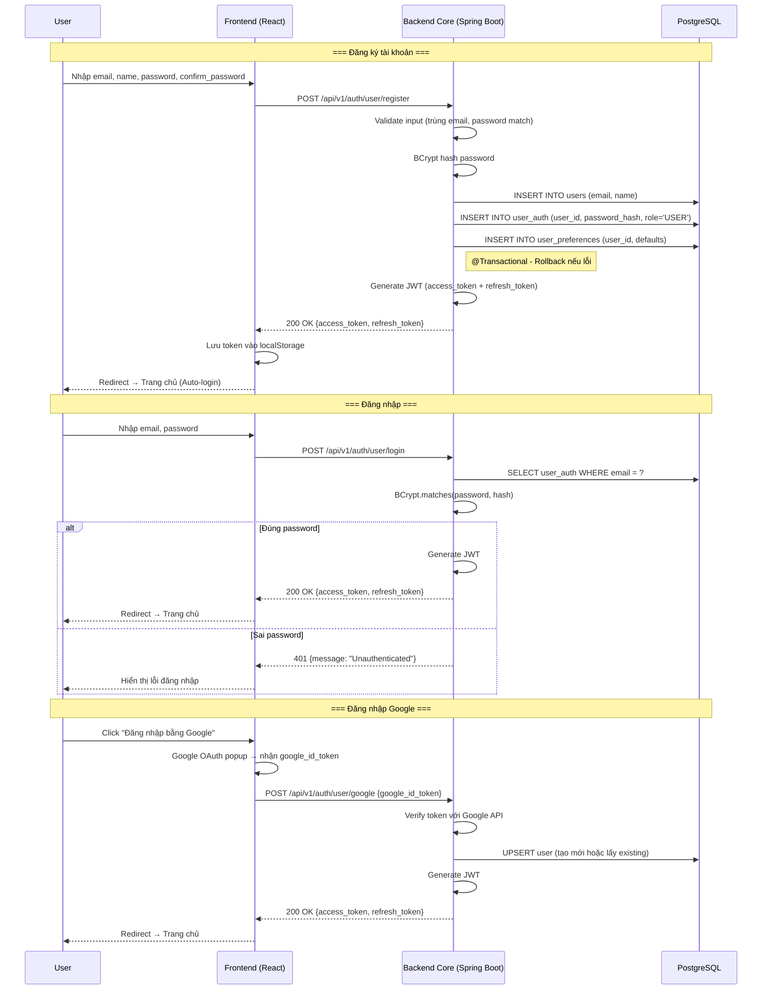
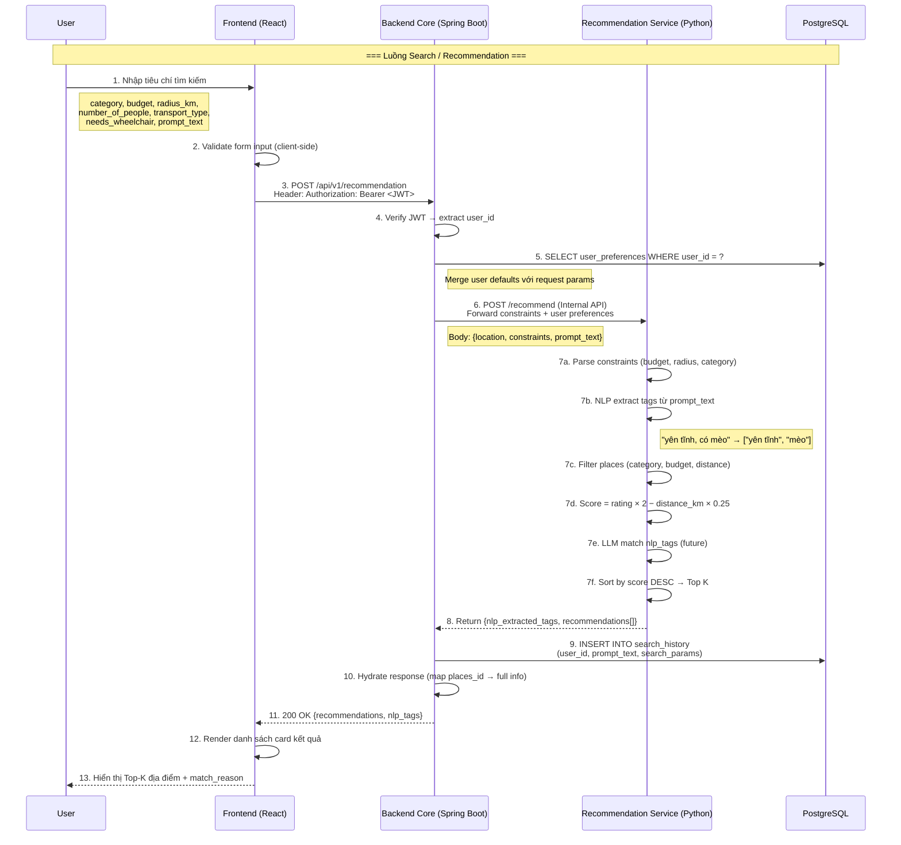
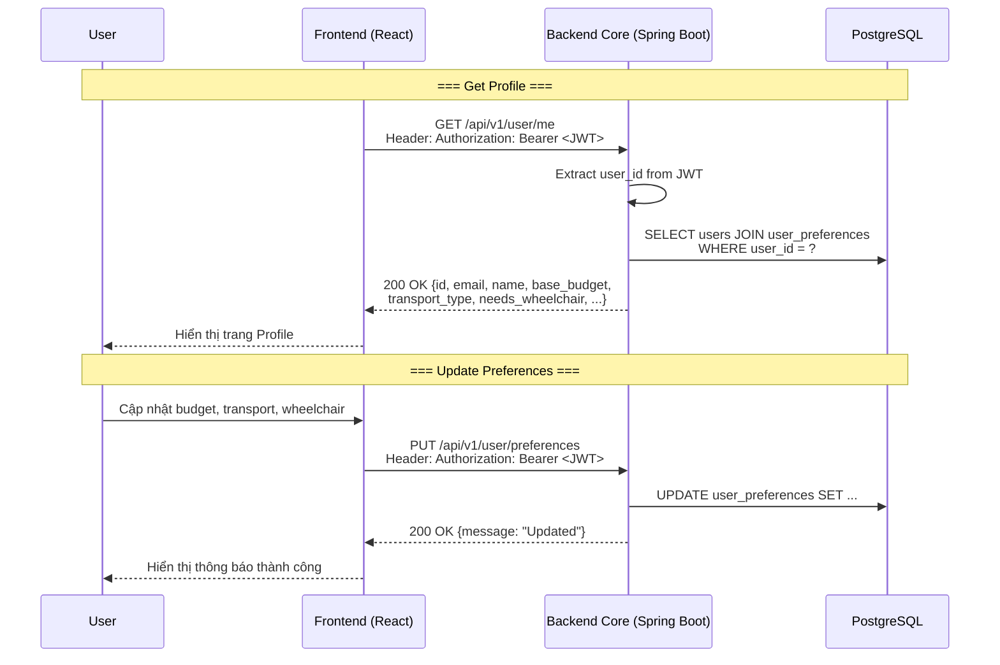
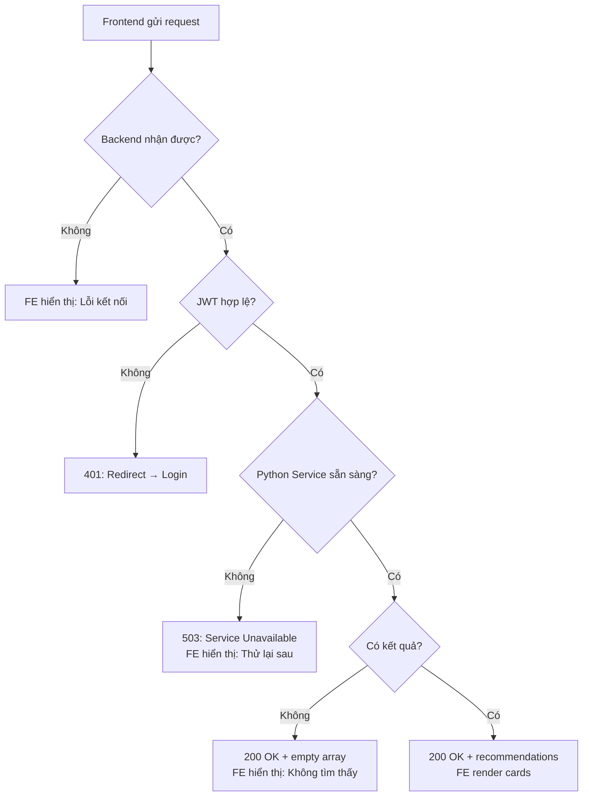

# Integration Flow – Smart Travel System

> Tài liệu mô tả luồng tương tác end-to-end giữa **Frontend (ReactJS)**, **Backend Core (Spring Boot)**, và **Recommendation Service (Python/FastAPI)**.
> Phiên bản: v1.0 · Cập nhật: 2026-04-25

---

## 1. Tổng quan kiến trúc

```
┌──────────────┐       REST/JSON        ┌──────────────────┐      REST/JSON       ┌─────────────────────────┐
│              │  ──────────────────►   │                  │  ──────────────────►  │                         │
│  Frontend    │                        │  Backend Core    │                       │  Recommendation Service │
│  (ReactJS)   │  ◄──────────────────   │  (Spring Boot)   │  ◄──────────────────  │  (Python / FastAPI)     │
│              │                        │                  │                       │                         │
└──────────────┘                        └────────┬─────────┘                       └────────────┬────────────┘
                                                 │                                              │
                                                 │  JDBC/JPA                                    │  Pandas / CSV
                                                 ▼                                              ▼
                                        ┌──────────────────┐                       ┌─────────────────────────┐
                                        │  PostgreSQL      │                       │  Data Layer             │
                                        │  + PostGIS       │                       │  (CSV → DB migration)   │
                                        └──────────────────┘                       └─────────────────────────┘
```

### Vai trò từng layer

| Layer | Công nghệ | Trách nhiệm chính |
|---|---|---|
| **Frontend Web** | ReactJS + TailwindCSS | Giao diện người dùng, form input, hiển thị kết quả, gọi REST API đến Backend Core |
| **Backend Core** | Java 17 + Spring Boot 3 | API Gateway, xác thực JWT, quản lý user/preferences, proxy request tới Recommendation Service, hydrate data từ DB |
| **Recommendation Service** | Python 3.11 + FastAPI | Tiền xử lý dữ liệu, NLP tag extraction, tính toán scoring/ranking, trả kết quả Top-K |
| **Database** | PostgreSQL 15 + PostGIS | Lưu trữ users, places, categories, ratings, search history |

---

## 2. Luồng tương tác chính (Integration Flows)

### 2.1 Luồng Đăng ký & Đăng nhập (Authentication Flow)



---

### 2.2 Luồng Tìm kiếm & Gợi ý (Recommendation Flow) ⭐ Luồng chính

Đây là luồng tích hợp **quan trọng nhất**, kết nối cả 3 layer: Frontend → Backend → Python Service.



---

### 2.3 Luồng xem Profile & Cập nhật Preferences



---

## 3. API Contract chi tiết

### 3.1 Frontend → Backend Core

| # | Method | Endpoint | Mô tả | Auth |
|---|---|---|---|---|
| 1 | POST | `/api/v1/auth/user/register` | Đăng ký tài khoản | ❌ |
| 2 | POST | `/api/v1/auth/user/login` | Đăng nhập email/password | ❌ |
| 3 | POST | `/api/v1/auth/user/google` | Đăng nhập Google | ❌ |
| 4 | POST | `/api/v1/auth/admin/login` | Admin đăng nhập | ❌ |
| 5 | GET | `/api/v1/user/me` | Lấy thông tin profile | ✅ JWT |
| 6 | POST | `/api/v1/recommendation` | Tìm kiếm & gợi ý địa điểm | ✅ JWT |

### 3.2 Backend Core → Recommendation Service (Internal)

| # | Method | Endpoint | Mô tả |
|---|---|---|---|
| 1 | POST | `/recommend` | Gửi constraints, nhận Top-K results |
| 2 | GET | `/health` | Health check |

### 3.3 Response Format chuẩn

Tất cả API trả về response theo format thống nhất:

```json
// Success
{
  "status": "success",
  "message": "Optional message",
  "data": { ... }
}

// Error
{
  "status": "error",
  "message": "Error description"
}
```

---

## 4. Data Flow chi tiết

### 4.1 Request Flow: Frontend → Backend → Python

```
┌─────────────────────────────────────────────────────────────────────┐
│  FRONTEND (React)                                                    │
│                                                                      │
│  FormData = {                                                        │
│    location: {type: "COORDINATES", lat: 10.76, lng: 106.68},        │
│    constraints: {                                                    │
│      budget: {amount: 500000, currency: "VND"},                     │
│      radius_km: 5.0,                                                │
│      number_of_people: 3,                                           │
│      transport_type: "MOTORBIKE",                                   │
│      needs_wheelchair: false,                                       │
│      main_category: "FOOD",                                         │
│      sub_category: "CAFE"                                           │
│    },                                                                │
│    prompt_text: "Mình muốn không gian yên tĩnh, có mèo"            │
│  }                                                                   │
└─────────────────────────┬───────────────────────────────────────────┘
                          │ POST /api/v1/recommendation
                          │ Authorization: Bearer <JWT>
                          ▼
┌─────────────────────────────────────────────────────────────────────┐
│  BACKEND CORE (Spring Boot)                                          │
│                                                                      │
│  1. JwtFilter → verify token → extract userId                       │
│  2. Load user_preferences from DB                                    │
│  3. Merge defaults: if budget is null → use user's base_budget      │
│  4. Build internal RecommendationRequest DTO                         │
│  5. Call Recommendation Service via RestTemplate/WebClient           │
└─────────────────────────┬───────────────────────────────────────────┘
                          │ POST /recommend (internal)
                          ▼
┌─────────────────────────────────────────────────────────────────────┐
│  RECOMMENDATION SERVICE (Python / FastAPI)                           │
│                                                                      │
│  Pipeline:                                                           │
│  ┌──────────┐    ┌──────────┐    ┌──────────┐    ┌──────────┐      │
│  │  Parse   │───►│  Filter  │───►│  Score   │───►│  Rank    │      │
│  │  Input   │    │  Places  │    │  Places  │    │  Top-K   │      │
│  └──────────┘    └──────────┘    └──────────┘    └──────────┘      │
│                                                                      │
│  Filter: category match + budget ≤ max + distance ≤ radius          │
│  Score:  rating × 2 − distance_km × 0.25                            │
│  Sort:   score DESC → rating DESC → distance ASC                    │
└─────────────────────────────────────────────────────────────────────┘
```

### 4.2 Response Flow: Python → Backend → Frontend

```
┌─────────────────────────────────────────────────────────────────────┐
│  RECOMMENDATION SERVICE response:                                    │
│  {                                                                   │
│    nlp_extracted_tags: ["yên tĩnh", "mèo"],                        │
│    recommendations: [                                                │
│      {places_id, name, lat, lng, images_url,                        │
│       match_score, distance_km, price_level, match_reason}          │
│    ]                                                                 │
│  }                                                                   │
└─────────────────────────┬───────────────────────────────────────────┘
                          │
                          ▼
┌─────────────────────────────────────────────────────────────────────┐
│  BACKEND CORE:                                                       │
│  1. Nhận response từ Python service                                  │
│  2. Lưu search_history (user_id, params, prompt_text)               │
│  3. Map places_id → bảng Places (nếu cần hydrate thêm info)        │
│  4. Wrap trong ResponseDTO chuẩn                                     │
│  5. Trả về Frontend                                                  │
└─────────────────────────┬───────────────────────────────────────────┘
                          │
                          ▼
┌─────────────────────────────────────────────────────────────────────┐
│  FRONTEND:                                                           │
│  1. Parse JSON response                                              │
│  2. Hiển thị nlp_extracted_tags dạng badge                          │
│  3. Render recommendation cards:                                     │
│     - Tên địa điểm + ảnh                                            │
│     - match_score (%)                                                │
│     - distance_km + price_level                                      │
│     - match_reason (explainable)                                     │
│  4. Xử lý trạng thái: loading / empty / error                      │
└─────────────────────────────────────────────────────────────────────┘
```

---

## 5. Xử lý lỗi & Edge Cases

### 5.1 Error Handling theo layer

| Layer | Lỗi | HTTP Code | Xử lý |
|---|---|---|---|
| Frontend | Form validation fail | N/A | Hiển thị inline error, chặn submit |
| Frontend | Network timeout | N/A | Hiển thị "Không kết nối được server" |
| Backend | JWT expired/invalid | 401 | Trả `{status: "error", message: "Unauthenticated"}` |
| Backend | Recommendation Service unreachable | 503 | Trả `{status: "error", message: "Service unavailable"}` |
| Backend | Invalid request body | 400 | Trả `{status: "error", message: "Bad Request"}` |
| Python | No places match filters | 200 | Trả `{recommendations: []}` (empty array) |
| Python | Data file not found | 500 | Log error, trả `{status: "error"}` |
| Database | Connection refused | 503 | Backend catch exception, trả 503 |

### 5.2 Fallback Strategy



---

## 6. Cấu hình môi trường

### 6.1 Ports & URLs

| Service | Port (Dev) | Base URL |
|---|---|---|
| Frontend (React) | 3000 | `http://localhost:3000` |
| Backend Core (Spring Boot) | 8080 | `http://localhost:8080/api/v1` |
| Recommendation Service (FastAPI) | 8000 | `http://localhost:8000` |
| PostgreSQL | 5432 | `jdbc:postgresql://localhost:5432/smarttravel` |

### 6.2 Environment Variables

```env
# Backend Core
SPRING_DATASOURCE_URL=jdbc:postgresql://localhost:5432/smarttravel
SPRING_DATASOURCE_USERNAME=postgres
SPRING_DATASOURCE_PASSWORD=postgres
RECOMMENDATION_SERVICE_URL=http://localhost:8000
JWT_SECRET=<your-secret-key>

# Recommendation Service
APP_DATA_PATH=data/processed/places_sample.csv
APP_RADIUS_KM=3.0
APP_TOP_K=5
DATABASE_URL=postgresql://localhost:5432/smarttravel

# Frontend
REACT_APP_API_BASE_URL=http://localhost:8080/api/v1
```

---

## 7. Trạng thái hiện tại vs Kế hoạch

| Component                  | Trạng thái hiện tại                             |
| -------------------------- | ----------------------------------------------- |
| Frontend (ReactJS)         | Chưa implement (chỉ có cấu trúc project/README) |
| Backend Core (Spring Boot) | Skeleton (chưa có đầy đủ API)                   |
| Recommendation Service     | Prototype chạy độc lập (Streamlit + CSV)        |
| Database (PostgreSQL)      | Đã thiết kế schema, chưa deploy                 |
| Tích hợp E2E               | Chưa kết nối các service                        |

---

## Định hướng tích hợp

| Component              | Kế hoạch                                                |
| ---------------------- | ------------------------------------------------------- |
| Frontend               | Xây dựng form input + hiển thị kết quả (cards)          |
| Backend Core           | Implement Auth + Recommendation API                     |
| Recommendation Service | Chuyển từ Streamlit → FastAPI (`/recommend`, `/health`) |
| Database               | Viết migration + kết nối Backend                        |
| Integration            | Kết nối Frontend → Backend → Python                     |

---

## Lưu ý quan trọng

> Hệ thống hiện tại **chưa tích hợp hoàn chỉnh**, các thành phần đang hoạt động độc lập.
> Khi tích hợp cần đảm bảo:

1. Recommendation Service expose API:

   * `POST /recommend`
   * `GET /health`

2. Backend Core:

   * Là layer trung gian (API Gateway)
   * Không truy cập trực tiếp data từ Python service

3. Frontend:

   * Chỉ gọi Backend (`/api/v1/...`)
   * Không gọi trực tiếp Python service

---

## 8. Checklist tích hợp

* [ ] Backend gọi được Python service (`/recommend`)
* [ ] Frontend gọi được Backend API
* [ ] JWT authentication hoạt động
* [ ] Database kết nối thành công
* [ ] Recommendation flow chạy end-to-end (có kết quả trả về)
* [ ] Xử lý lỗi cơ bản (401, 500, không có kết quả)


---

## 8. Checklist tích hợp (cho DevOps)

- [ ] Docker Compose file với 4 services (frontend, backend, python, postgres)
- [ ] Network bridge cho internal communication
- [ ] Health check endpoints trên mỗi service
- [ ] CORS configuration trên Backend Core
- [ ] Environment variables thống nhất qua `.env` file
- [ ] Volume mount cho PostgreSQL data persistence
- [ ] Log aggregation cơ bản (stdout/stderr)
