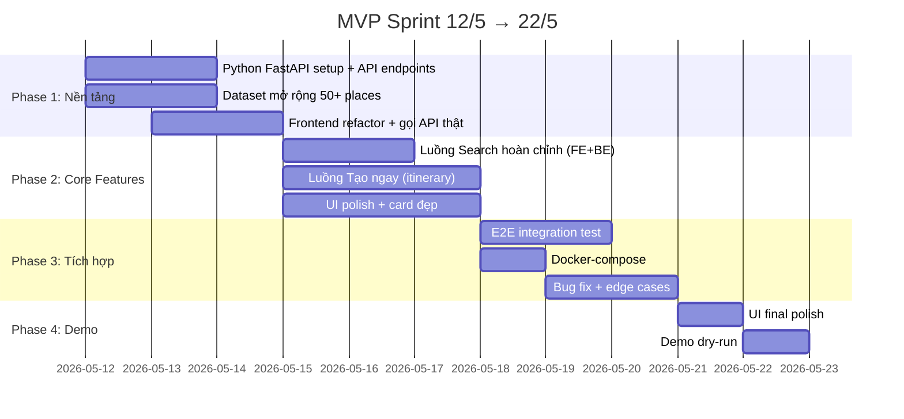

# 🚀 Kế hoạch Sprint MVP — 12/5 → 22/5/2026

**Deadline nộp MVP:** 25/5 | **Demo nội bộ kiểm tra:** 22/5 tối | **Còn 11 ngày**

---

## 0. Đánh giá hiện trạng (tính đến 11/5)

### ✅ Đã có
| Component | Trạng thái | Chi tiết |
|-----------|-----------|---------|
| `recommendation-service` | Hoạt động | Recommender v0 (scoring), data adapter v1, dataset 8 places, **nhưng chạy Streamlit** |
| `backend-core` | Skeleton | Spring Boot + JPA + Security + DTOs + Controllers, **chưa có pom.xml build, chưa kết nối DB** |
| `frontend-web` | Sơ sài | Vite + React Router, 2 pages (Home/Search), mock data, **chưa gọi API** |
| `docs` | Tốt | Scope, Problem Analysis, Integration Flow, Smoke Test 47 cases |

### ❌ Thiếu cho MVP (theo Acceptance Criteria)
| # | Tiêu chí | Trạng thái |
|---|---------|-----------|
| AC-1 | Người dùng gõ địa điểm và lọc được kết quả đúng điều kiện | ❌ Frontend dùng mock data |
| AC-2 | Kết quả Search hiển thị dạng card, dễ so sánh | ⚠️ Card rất sơ sài (12 dòng) |
| AC-3 | Nút Tạo ngay tạo được lịch trình cơ bản trong ngày | ❌ Chưa có |
| AC-4 | Luồng gọi service chạy end-to-end không lỗi | ❌ Chưa tích hợp |
| AC-5 | Demo 3-5 phút chạy ổn định | ❌ Chưa thể demo |

---

## 1. Chiến lược tổng thể

### Quyết định kiến trúc cho MVP

> [!IMPORTANT]
> **Đề xuất đơn giản hoá kiến trúc cho kịp MVP:** Bỏ backend-core (Spring Boot) khỏi luồng chính MVP. Thay vào đó, frontend gọi **trực tiếp** recommendation-service (chuyển từ Streamlit sang FastAPI). Backend-core sẽ phát triển song song nhưng chưa bắt buộc cho demo.
>
> **Lý do:** Spring Boot cần PostgreSQL, setup phức tạp, 11 ngày không đủ để hoàn thiện cả 3 tầng. FastAPI + CSV đủ demo luồng chính.

### Kiến trúc MVP thực tế

```
┌──────────────┐     HTTP/JSON      ┌──────────────────────┐
│ frontend-web │ ──────────────────→ │ recommendation-      │
│ (React+Vite) │ ←────────────────── │ service (FastAPI)     │
│ :3000        │                     │ :8000                 │
└──────────────┘                     │ + CSV dataset         │
                                     │ + scoring algorithm   │
                                     │ + itinerary generator │
                                     └──────────────────────┘
```

---

## 2. Phân chia giai đoạn



---

## 3. Phân công theo ngày chi tiết

### PHASE 1: NỀN TẢNG (12/5 Thứ Hai → 14/5 Thứ Tư)

#### 📅 Ngày 12/5 (Thứ Hai)

| Thành viên | Task | Output | Deadline |
|-----------|------|--------|----------|
| **Thịnh** | Chuyển recommendation-service từ Streamlit → FastAPI. Tạo 3 endpoints: `GET /health`, `POST /recommend`, `POST /itinerary` | `app.py` dùng FastAPI, chạy `uvicorn` được | 22:00 |
| **Nguyên** | Mở rộng dataset từ 8 → 30+ places (HCM, Đà Lạt, Đà Nẵng). Thêm fields: `address`, `opening_hours`, `description` | `places_v2_full.csv` 30+ dòng | 22:00 |
| **Hoàng** | Setup Vite proxy, tạo `api.js` service layer gọi FastAPI. Xoá mock data | Frontend gọi được `/health` endpoint | 22:00 |
| **Phước** | Kick-off meeting, giao task, setup Trello cards W4-W5. Chốt API contract chính thức | `API_Contract_MVP.md` | 22:00 |

#### 📅 Ngày 13/5 (Thứ Ba)

| Thành viên | Task | Output | Deadline |
|-----------|------|--------|----------|
| **Thịnh** | Implement `/recommend` endpoint: nhận JSON request, gọi data_adapter + recommender, trả kết quả JSON | Endpoint chạy được với Postman | 22:00 |
| **Nguyên** | Tiếp tục mở rộng dataset → 50+ places. Thêm thêm categories: sightseeing, restaurant, hotel | `places_v2_full.csv` 50+ dòng | 22:00 |
| **Hoàng** | Refactor `SearchPage.jsx` — gọi `/recommend` API thay vì mock data. Thêm loading/error states | Search gọi API thật, hiển thị kết quả | 22:00 |
| **Minh** | Redesign `PlaceCard.jsx` — thêm rating stars, price badge, distance, category icon, match_reason | Card component đẹp, có đủ thông tin | 22:00 |
| **Duy** | Thiết kế wireframe mid-fidelity cho HomePage, SearchPage, ItineraryPage (Figma hoặc tay) | 3 wireframes + gửi cho Hoàng/Minh | 22:00 |
| **Phước** | Review code Thịnh + Hoàng. Viết tài liệu Decomposition & Pattern Recognition cho báo cáo | Tài liệu phần "Phân rã" | 22:00 |

#### 📅 Ngày 14/5 (Thứ Tư)

| Thành viên | Task | Output | Deadline |
|-----------|------|--------|----------|
| **Thịnh** | Implement `/itinerary` endpoint: nhận constraints, sinh lịch trình sáng-trưa-chiều-tối. Mỗi slot chọn 1 place + lý do | Endpoint trả itinerary JSON | 22:00 |
| **Nguyên** | Kiểm tra data quality, fix null values, thêm `match_reason` template vào recommender | Data sạch + recommender có match_reason | 22:00 |
| **Hoàng** | Implement `HomePage` theo wireframe Duy — Search bar nổi bật + CTA "Tạo ngay" | HomePage đẹp, responsive | 22:00 |
| **Minh** | Tạo `FilterPanel` component — dropdowns cho category, slider cho budget/distance | FilterPanel riêng, tái sử dụng được | 22:00 |
| **Duy** | Review UI Hoàng + Minh, chỉnh sửa wireframe nếu cần. Chọn color palette + font | UI guideline doc | 22:00 |
| **Chính** | Tạo `docker-compose.yml` cho FastAPI + Frontend (dev mode). Setup CORS | 2 services chạy được qua docker-compose | 22:00 |
| **Bảo** | Cập nhật Problem Analysis + viết phần Decomposition cho báo cáo | Bản nháp 2 mục báo cáo | 22:00 |
| **Phước** | **Checkpoint giữa Phase 1** — review tích hợp FE ↔ Python. Fix blockers | Biên bản checkpoint | 22:00 |

---

### PHASE 2: CORE FEATURES (15/5 Thứ Năm → 17/5 Thứ Bảy)

#### 📅 Ngày 15/5 (Thứ Năm)

| Thành viên | Task | Output | Deadline |
|-----------|------|--------|----------|
| **Thịnh** | Thêm validation cho `/recommend` + `/itinerary`. Handle edge cases (no results, invalid params) | Error responses chuẩn, không crash | 22:00 |
| **Nguyên** | Implement scoring formula nâng cao: `score = w1*rating + w2*(1/distance) + w3*preference_match`. Tunable weights | Recommender v2 với weighted scoring | 22:00 |
| **Hoàng** | Tạo `ItineraryPage.jsx` — form input (ngày đi, sở thích, ngân sách, bán kính) + gọi `/itinerary` | Form submit → hiển thị kết quả | 22:00 |
| **Minh** | Tạo `ItineraryCard.jsx` / timeline component — hiển thị lịch trình theo mốc giờ (sáng/trưa/chiều/tối) | Timeline UI với slot cards | 22:00 |
| **Duy** | Thiết kế chi tiết Itinerary result layout (timeline style). Review Search card mới | Wireframe Itinerary result | 20:00 |
| **Chính** | Setup backend-core build (mvnw, pom.xml verify). Chuẩn bị cho giai đoạn sau | Backend-core `mvn compile` pass | 22:00 |

#### 📅 Ngày 16/5 (Thứ Sáu)

| Thành viên | Task | Output | Deadline |
|-----------|------|--------|----------|
| **Thịnh** | Thêm `match_reason` vào response recommend + itinerary. VD: "Gần bạn 1.2km, rating cao 4.6" | Mỗi place có `match_reason` string | 22:00 |
| **Nguyên** | Implement itinerary scheduling logic — đảm bảo không chọn trùng place, phù hợp time slot | Itinerary logic ổn định | 22:00 |
| **Hoàng** | Hoàn thiện luồng Search end-to-end: input → loading → results/empty → detail | Luồng Search chạy mượt | 22:00 |
| **Minh** | Hoàn thiện luồng Itinerary end-to-end: form → loading → timeline result | Luồng Tạo ngay chạy mượt | 22:00 |
| **Duy** | Polish toàn bộ CSS — colors, typography, spacing, hover effects, transitions | CSS hoàn chỉnh, consistent | 22:00 |
| **Bảo** | Viết phần Abstraction + Algorithm Design cho báo cáo. Bao gồm pseudocode scoring | 2 mục báo cáo hoàn chỉnh | 22:00 |
| **Phước** | **Checkpoint cuối Phase 2** — test cả 2 luồng Search + Tạo ngay | Biên bản + danh sách bug | 22:00 |

#### 📅 Ngày 17/5 (Thứ Bảy)

| Thành viên | Task | Output | Deadline |
|-----------|------|--------|----------|
| **Thịnh** | Fix bugs từ checkpoint. Thêm endpoint `GET /categories` để frontend lấy danh sách category động | Bugs fixed + categories API | 20:00 |
| **Nguyên** | Mở rộng dataset đến 80-100+ places (thêm Hội An, Nha Trang, Phú Quốc). Data quality check | Dataset final cho demo | 20:00 |
| **Hoàng** | Responsive design cho mobile (375px). Fix UI bugs từ checkpoint | Responsive hoàn chỉnh | 22:00 |
| **Minh** | Thêm empty state, error state, no-results illustrations. Toast notifications | UX states hoàn chỉnh | 22:00 |
| **Duy** | Tạo logo/banner đơn giản cho Smart Travel. Final UI review | Assets + UI sign-off | 20:00 |
| **Chính** | Cập nhật docker-compose production-ready. README hướng dẫn setup | Docker + README hoàn chỉnh | 22:00 |
| **Bảo** | Chạy smoke test theo checklist (Phần E + F) | Test report v1 | 22:00 |
| **Phước** | Review toàn bộ code quality. Viết phần Abstraction cho báo cáo | Code review notes | 22:00 |

---

### PHASE 3: TÍCH HỢP & HOÀN THIỆN (18/5 Chủ Nhật → 20/5 Thứ Ba)

#### 📅 Ngày 18/5 (Chủ Nhật)

| Thành viên | Task | Output | Deadline |
|-----------|------|--------|----------|
| **Tất cả** | **Integration test toàn bộ** — chạy cả hệ thống từ đầu đến cuối | Hệ thống chạy E2E | 22:00 |
| **Thịnh + Nguyên** | Fix backend bugs, optimize scoring khi chạy dataset lớn | Performance OK | 22:00 |
| **Hoàng + Minh** | Fix frontend bugs, polish UI cuối | UI ổn định | 22:00 |
| **Chính** | Đảm bảo docker-compose chạy trên máy khác (test cross-platform) | Docker verified | 22:00 |
| **Bảo** | Chạy full smoke test (47 test cases — skip phần B auth + D profile) | Test report v2 | 22:00 |
| **Duy** | Chuẩn bị screenshots cho báo cáo + slide | Screenshots folder | 22:00 |
| **Phước** | Bug triage — ưu tiên P0/P1, cắt scope P2 nếu cần | Bug priority list | 22:00 |

#### 📅 Ngày 19/5 (Thứ Hai)

| Thành viên | Task | Output | Deadline |
|-----------|------|--------|----------|
| **Thịnh** | Fix P0 bugs. Thêm CORS headers nếu thiếu | Bugs fixed | 22:00 |
| **Nguyên** | Viết pseudocode + flowchart cho scoring algorithm (cho báo cáo) | Pseudocode + flowchart | 22:00 |
| **Hoàng** | Fix P0 UI bugs. Đảm bảo luồng happy path không lỗi | Happy path verified | 22:00 |
| **Minh** | Fix P0 UI bugs. Test responsive trên nhiều kích thước | Responsive verified | 22:00 |
| **Duy** | Bắt đầu slide thuyết trình — outline + 5-7 slides đầu | Slide draft v1 | 22:00 |
| **Chính** | Tạo script demo tự động (nếu cần). Release notes | Demo script | 22:00 |
| **Bảo** | Viết phần Kiểm thử & Cải tiến cho báo cáo | Mục báo cáo kiểm thử | 22:00 |
| **Phước** | Tổng hợp báo cáo — merge tất cả mục từ team | Báo cáo draft v1 | 22:00 |

#### 📅 Ngày 20/5 (Thứ Ba)

| Thành viên | Task | Output | Deadline |
|-----------|------|--------|----------|
| **Thịnh + Nguyên** | Bug fix cuối + code freeze Python service | Python service FROZEN | 20:00 |
| **Hoàng + Minh** | Bug fix cuối + code freeze Frontend | Frontend FROZEN | 20:00 |
| **Duy** | Hoàn thành slide thuyết trình 15-20 slides | Slide v2 hoàn chỉnh | 22:00 |
| **Chính** | Code freeze → tag `v0.1-mvp` | Git tag | 20:00 |
| **Bảo** | Final test trên bản frozen | Final test report | 22:00 |
| **Phước** | Review slide + báo cáo. Chốt script demo 3-5 phút | Demo script final | 22:00 |

---

### PHASE 4: DEMO PREP (21/5 Thứ Tư → 22/5 Thứ Năm)

#### 📅 Ngày 21/5 (Thứ Tư)

| Thành viên | Task | Output | Deadline |
|-----------|------|--------|----------|
| **Tất cả** | Tập demo lần 1 — mỗi người nói phần mình (2-3 phút/người) | Demo run-through #1 | 21:00 |
| **Bảo** | Kiểm tra format báo cáo, tên file, checklist nộp bài | Submission checklist | 20:00 |
| **Duy** | Chỉnh slide theo feedback từ tập demo | Slide final | 22:00 |
| **Phước** | Fix flow demo nếu cần. Chuẩn bị Q&A | Q&A prep doc | 22:00 |

#### 📅 Ngày 22/5 (Thứ Năm) — **DEMO NỘI BỘ**

| Thời gian | Hoạt động |
|-----------|----------|
| 19:00-19:30 | Setup môi trường demo (docker-compose up) |
| 19:30-20:00 | **Demo run-through** — chạy cả 2 luồng Search + Tạo ngay |
| 20:00-20:30 | Review kết quả, fix last-minute issues |
| 20:30-21:00 | Tập thuyết trình lần cuối |
| 21:00-21:30 | **Freeze tất cả** — không sửa code sau mốc này |

---

## 4. API Contract MVP (Đề xuất)

### `GET /health`
```json
→ Response: { "status": "ok", "version": "0.1.0" }
```

### `POST /recommend`
```json
→ Request:
{
  "location": { "type": "COORDINATES", "lat": 10.76, "lng": 106.68 },
  "constraints": {
    "budget": "medium",
    "radius_km": 5.0,
    "category": "cafe"
  },
  "top_k": 5
}

→ Response:
{
  "places": [
    {
      "place_id": "plc-0001",
      "name": "Cafe Meo Co",
      "category": "cafe",
      "price_level": "medium",
      "rating": 4.6,
      "distance_km": 1.2,
      "score": 8.9,
      "match_reason": "Gần bạn 1.2km, rating 4.6⭐, phù hợp ngân sách",
      "image_url": "https://example.com/cafe.jpg"
    }
  ],
  "total_count": 5
}
```

### `POST /itinerary`
```json
→ Request:
{
  "location": { "type": "COORDINATES", "lat": 10.76, "lng": 106.68 },
  "preferences": ["cafe", "sightseeing", "food"],
  "budget": "medium",
  "radius_km": 5.0
}

→ Response:
{
  "itinerary": [
    { "time_slot": "morning",   "label": "🌅 Sáng (8:00-11:00)",  "place": {...}, "reason": "Cafe yên tĩnh để bắt đầu ngày" },
    { "time_slot": "lunch",     "label": "🍜 Trưa (11:30-13:30)", "place": {...}, "reason": "Phở ngon gần đó, giá rẻ" },
    { "time_slot": "afternoon", "label": "🌤 Chiều (14:00-17:00)", "place": {...}, "reason": "Công viên thoáng mát, đi bộ" },
    { "time_slot": "evening",   "label": "🌙 Tối (18:00-21:00)",  "place": {...}, "reason": "Khu phố cổ, street food nổi tiếng" }
  ]
}
```

### `GET /categories`
```json
→ Response: { "categories": ["cafe", "food", "hotel", "sightseeing", "park", "museum"] }
```

---

## 5. Quy tắc Sprint

### Nhánh Git
```
main                          ← protected, chỉ merge qua PR
├── feat/fastapi-setup        ← Thịnh
├── feat/dataset-expand       ← Nguyên
├── feat/frontend-search      ← Hoàng
├── feat/frontend-itinerary   ← Hoàng + Minh
├── feat/ui-components        ← Minh
├── feat/ui-polish            ← Duy
├── chore/docker-compose      ← Chính
└── docs/report-sections      ← Bảo + Phước
```

### Daily standup (Zalo group)
Trước **23:00 mỗi ngày**, mỗi người gửi:
```
✅ Hôm nay: [việc đã xong]
🔲 Ngày mai: [việc sẽ làm]
🚫 Blocker: [nếu có]
```

### Escalation
- Block > 4 giờ → tag backup trên Zalo
- Block > 8 giờ → PM quyết định cắt scope hoặc reassign

---

## 6. Rủi ro & Phương án dự phòng

| Rủi ro | Xác suất | Impact | Phương án |
|--------|---------|--------|----------|
| FastAPI setup khó hơn dự kiến | Thấp | Cao | Dùng Flask đơn giản hơn nếu cần |
| Frontend không kịp UI đẹp | Trung bình | Trung bình | Dùng component library (MUI/Ant Design) |
| Dataset quá ít để demo thuyết phục | Thấp | Cao | Sinh data faker từ Google Maps |
| Docker không chạy trên máy demo | Trung bình | Cao | Chuẩn bị script `npm run dev` + `uvicorn` trực tiếp |
| Luồng Tạo ngay không kịp | Trung bình | Cao | **Cắt scope**: demo Search only, Tạo ngay mock |
| Thành viên không response | Trung bình | Cao | PM reassign cho backup ngay sau 8h |

> [!WARNING]
> **Nếu đến 17/5 chưa có luồng Search chạy E2E → phải cắt scope luồng "Tạo ngay" và tập trung hoàn thiện Search đẹp + ổn định.**

---

## Open Questions

> [!IMPORTANT]
> 1. **Bỏ Spring Boot khỏi MVP?** Đề xuất: Frontend gọi thẳng FastAPI. Backend-core phát triển song song, tích hợp sau MVP. Bạn đồng ý không?
> 2. **Luồng "Tạo ngay" scope như nào?** Chỉ 1 ngày (sáng-trưa-chiều-tối), hay multi-day? Đề xuất: 1 ngày cho MVP.
> 3. **Dataset lấy từ đâu?** Google Maps scrape, Kaggle, hay tự tạo? Đề xuất: mix Kaggle + tự thêm cho đủ 50-100 places.
> 4. **Có cần Auth/Login cho MVP demo không?** Đề xuất: KHÔNG — demo guest mode, không cần đăng nhập.
