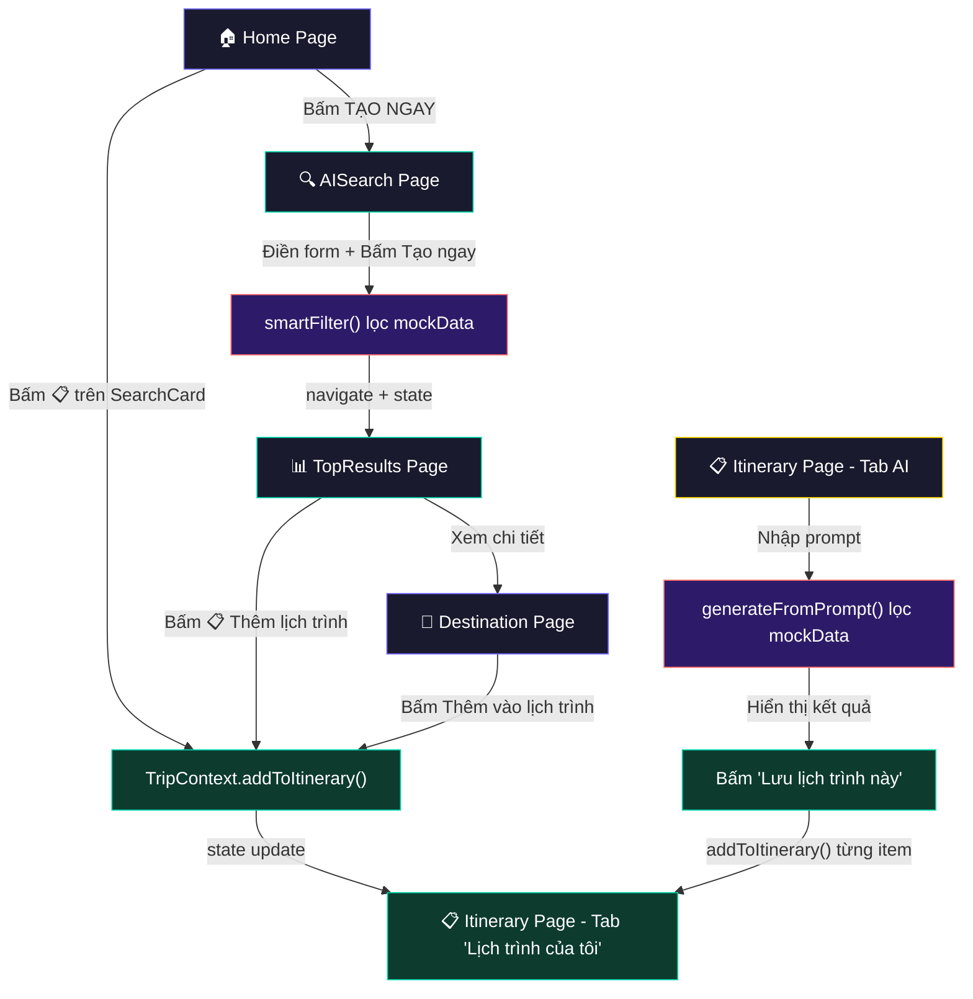
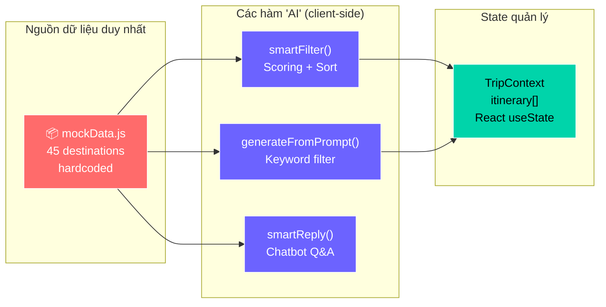

# Luồng Tạo Lịch Trình — Smart Travel Frontend

## Tổng quan

Hệ thống có **2 cách** để tạo lịch trình:
1. **Thủ công**: Người dùng tự thêm từng địa điểm vào lịch trình
2. **AI tạo tự động**: Người dùng nhập sở thích, "AI" gợi ý lịch trình

> [!IMPORTANT]
> **Toàn bộ "AI" trong hệ thống hiện tại đều KHÔNG gọi API AI thật.** Chúng là các hàm filter/sort JavaScript chạy trên **mock data cục bộ** (45 địa điểm hardcoded). Không có backend AI nào được gọi cho phần tạo lịch trình.

---

## Sơ đồ tổng quát



---

## Các file cần đọc (theo thứ tự quan trọng)

| # | File | Vai trò |
|---|------|---------|
| 1 | [mockData.js](file:///c:/Frontend/smart-travel/frontend-web/src/data/mockData.js) | **Nguồn dữ liệu duy nhất** — 45 địa điểm hardcoded |
| 2 | [TripContext.jsx](file:///c:/Frontend/smart-travel/frontend-web/src/context/TripContext.jsx) | **State trung tâm** — quản lý `itinerary[]`, `favorites[]` |
| 3 | [AISearch.jsx](file:///c:/Frontend/smart-travel/frontend-web/src/pages/AISearch/AISearch.jsx) | **Form tìm kiếm AI** — hàm `smartFilter()` lọc địa điểm |
| 4 | [Itinerary.jsx](file:///c:/Frontend/smart-travel/frontend-web/src/pages/Itinerary/Itinerary.jsx) | **Trang lịch trình** — hiển thị + tạo AI bằng `generateFromPrompt()` |
| 5 | [TopResults.jsx](file:///c:/Frontend/smart-travel/frontend-web/src/pages/TopResults/TopResults.jsx) | **Kết quả AI Search** — hiển thị top N, nút thêm lịch trình |
| 6 | [Destination.jsx](file:///c:/Frontend/smart-travel/frontend-web/src/pages/Destination/Destination.jsx) | **Chi tiết địa điểm** — nút "Thêm vào lịch trình" |
| 7 | [SearchCard.jsx](file:///c:/Frontend/smart-travel/frontend-web/src/components/SearchCard/SearchCard.jsx) | **Card địa điểm** — nút 📋 thêm nhanh vào lịch trình |
| 8 | [ChatBot.jsx](file:///c:/Frontend/smart-travel/frontend-web/src/components/ChatBot/ChatBot.jsx) | **Chatbot** — chỉ trả lời Q&A, KHÔNG tạo lịch trình |

---

## Chi tiết từng luồng

### Luồng 1: Thêm thủ công vào lịch trình

Người dùng có thể thêm địa điểm vào lịch trình từ **3 nơi** khác nhau:

#### 1a. Từ SearchCard (Home, Search, Favorites)
```
Bấm nút 📋 trên card → gọi addToItinerary(destination)
```
- File: [SearchCard.jsx:44](file:///c:/Frontend/smart-travel/frontend-web/src/components/SearchCard/SearchCard.jsx#L44)

#### 1b. Từ trang Destination
```
Bấm "Thêm vào lịch trình" → gọi addToItinerary(dest)
```
- File: [Destination.jsx:21-24](file:///c:/Frontend/smart-travel/frontend-web/src/pages/Destination/Destination.jsx#L21-L24)

#### 1c. Từ trang TopResults
```
Bấm nút 📋 → gọi addToItinerary(d)
```
- File: [TopResults.jsx:155](file:///c:/Frontend/smart-travel/frontend-web/src/pages/TopResults/TopResults.jsx#L155)

#### Hàm `addToItinerary` trong TripContext

```javascript
// File: TripContext.jsx, dòng 66-71
const addToItinerary = useCallback((dest) => {
  setItinerary(prev => {
    if (prev.find(d => d.id === dest.id)) return prev  // tránh trùng
    return [...prev, { ...dest, addedAt: new Date().toISOString(), note: '' }]
  })
}, [])
```

> [!NOTE]
> Hàm này chỉ **thêm metadata** (`addedAt`, `note`) rồi push vào mảng state. Không có persistence (localStorage/API) — reload mất hết dữ liệu.

---

### Luồng 2: AI Search → TopResults → Thêm lịch trình

Đây là luồng "AI thông minh" chính:

```
Home → bấm "TẠO NGAY" → /ai-search → điền form → bấm "Tạo ngay" → /top-results
```

#### Bước 1: Người dùng điền form AISearch

Form gồm: ngân sách, số người, bán kính, thành phố, categories, mô tả tự do.

- File: [AISearch.jsx:118-127](file:///c:/Frontend/smart-travel/frontend-web/src/pages/AISearch/AISearch.jsx#L118-L127)

#### Bước 2: Hàm `smartFilter()` — "Bộ não AI"

> [!CAUTION]
> Đây **KHÔNG phải AI thật**. Đây là hàm JavaScript filter + scoring chạy hoàn toàn client-side trên mock data.

```javascript
// File: AISearch.jsx, dòng 40-114
function smartFilter(form) {
  return destinations
    .map(d => {
      let score = 0
      // City match      → +40 đến +80 điểm
      // Category match   → +30 điểm/category
      // Keyword match    → +6 đến +30 điểm/keyword
      // Semantic match   → +20-30 điểm (ăn, cafe, biển, đêm...)
      // Budget filter    → +10 điểm
      return { ...d, _score: score }
    })
    .filter(d => d._score > 0)        // bỏ những điểm 0
    .sort((a, b) => b._score - a._score)  // xếp theo điểm cao → thấp
    .slice(0, 10)                      // lấy tối đa 10
}
```

**Cách tính điểm cụ thể:**

| Tiêu chí | Điểm |
|----------|------|
| Title chứa tên thành phố | +80 |
| City khớp | +60 |
| Location chứa tên | +40 |
| Mỗi category khớp | +30 |
| Keyword trong title | +20 |
| Keyword trong category | +15 |
| Keyword trong categories | +12 |
| Keyword trong overview | +8 |
| Semantic: "ăn", "quán" → food | +25 |
| Semantic: "cafe" → cafe | +30 |
| Semantic: "biển" → beach/nature | +25 |
| Semantic: "miễn phí" + price=0 | +30 |
| Trong ngân sách | +10 |

#### Bước 3: Navigate sang TopResults với kết quả

```javascript
// File: AISearch.jsx, dòng 197-200
const handleCreate = () => {
  const results = smartFilter(form)
  navigate('/top-results', { state: { results, form } })
}
```

Kết quả được truyền qua **React Router state**, không lưu vào DB/localStorage.

#### Bước 4: TopResults hiển thị + thêm vào lịch trình

- File: [TopResults.jsx](file:///c:/Frontend/smart-travel/frontend-web/src/pages/TopResults/TopResults.jsx)
- Hiển thị top 3/5/10 kết quả
- Nút 📋 gọi `addToItinerary(d)` → thêm vào TripContext

---

### Luồng 3: AI tạo lịch trình trực tiếp (trong Itinerary page)

Đây là tab "Tạo lịch trình AI ✨" trong trang Itinerary:

#### Bước 1: Người dùng nhập prompt

Textarea + chips gợi ý: "Lịch sử & Bảo tàng", "Ẩm thực & Khám phá", "Miễn phí hoặc rẻ"...

- File: [Itinerary.jsx:130-148](file:///c:/Frontend/smart-travel/frontend-web/src/pages/Itinerary/Itinerary.jsx#L130-L148)

#### Bước 2: Hàm `generateFromPrompt()` — "AI tạo lịch trình"

> [!CAUTION]
> Đây cũng **KHÔNG phải AI thật**. Là hàm keyword-matching đơn giản.

```javascript
// File: Itinerary.jsx, dòng 11-27
function generateFromPrompt(prompt, list) {
  const t = prompt.toLowerCase()
  let filtered = [...list]    // list = destinations (45 items từ mockData)
  
  // Filter đơn giản bằng keyword
  if (t.includes('biển') || t.includes('beach'))
    filtered = filtered.filter(d => d.categories.includes('beach') || d.categories.includes('nature'))
  else if (t.includes('lịch sử') || t.includes('bảo tàng'))
    filtered = filtered.filter(d => d.categories.includes('history') || d.categories.includes('museum'))
  else if (t.includes('ăn') || t.includes('ẩm thực'))
    filtered = filtered.filter(d => d.categories.includes('food') || d.categories.includes('culture'))
  else if (t.includes('miễn phí') || t.includes('rẻ'))
    filtered = filtered.filter(d => d.price === 0)
  
  // Lấy tối đa 4 địa điểm, chia thành 2 ngày
  const picks = filtered.length >= 2 ? filtered.slice(0, 4) : list.slice(0, 4)
  return picks.map((dest, i) => ({
    ...dest,
    day: Math.floor(i / 2) + 1,         // 2 địa điểm/ngày
    timeSlot: i % 2 === 0 ? '08:00 - 10:30' : '14:00 - 16:30',
    note: '',
  }))
}
```

#### Bước 3: Giả lập loading (1.5s delay)

```javascript
// File: Itinerary.jsx, dòng 40-49
const handleGenerateAI = () => {
  setGenerating(true)
  setAiList([])
  setTimeout(() => {                    // ← fake delay, KHÔNG gọi API
    const result = generateFromPrompt(aiPrompt, destinations)
    setAiList(result)
    setGenerating(false)
  }, 1500)                              // ← chờ 1.5s cho giống AI đang xử lý
}
```

#### Bước 4: Lưu vào lịch trình

```javascript
// File: Itinerary.jsx, dòng 51-54
const saveAIItinerary = () => {
  aiList.forEach(d => addToItinerary(d))  // thêm từng item vào TripContext
  setTab('my')                             // chuyển sang tab "Lịch trình của tôi"
}
```

---

## Nguồn dữ liệu — Tóm tắt



| Thành phần | Nguồn dữ liệu | Có gọi API? | Ghi chú |
|------------|---------------|-------------|---------|
| `smartFilter()` trong AISearch | `mockData.destinations` | ❌ Không | Scoring + sort client-side |
| `generateFromPrompt()` trong Itinerary | `mockData.destinations` | ❌ Không | Keyword filter đơn giản |
| `smartReply()` trong ChatBot | `mockData.destinations` | ❌ Không (fallback) | Chatbot thử gọi Claude API trước, nếu fail thì dùng local |
| `TripContext.itinerary` | React state (RAM) | ❌ Không | Reload trang = mất dữ liệu |

> [!WARNING]
> **ChatBot** là thành phần duy nhất có **cố gắng** gọi API thật (Anthropic Claude API), nhưng:
> - Nó chỉ dùng cho **Q&A trò chuyện**, KHÔNG tạo lịch trình
> - Khi chạy local, API sẽ bị **CORS block** → tự động fallback về `smartReply()` (local)
> - File: [ChatBot.jsx:86-111](file:///c:/Frontend/smart-travel/frontend-web/src/components/ChatBot/ChatBot.jsx#L86-L111)

---

## Kết luận

1. **Không có AI thật** trong luồng tạo lịch trình. Tất cả đều là JavaScript filter/sort trên 45 địa điểm mock.
2. **Không có backend** nào được gọi cho tính năng lịch trình.
3. **Dữ liệu chỉ lưu trong RAM** (React state) — reload mất hết.
4. **`setTimeout(1500ms)`** được dùng để giả lập thời gian AI xử lý.
5. **ChatBot** có cố gắng gọi Claude API nhưng chỉ cho chat Q&A, không liên quan đến lịch trình.
